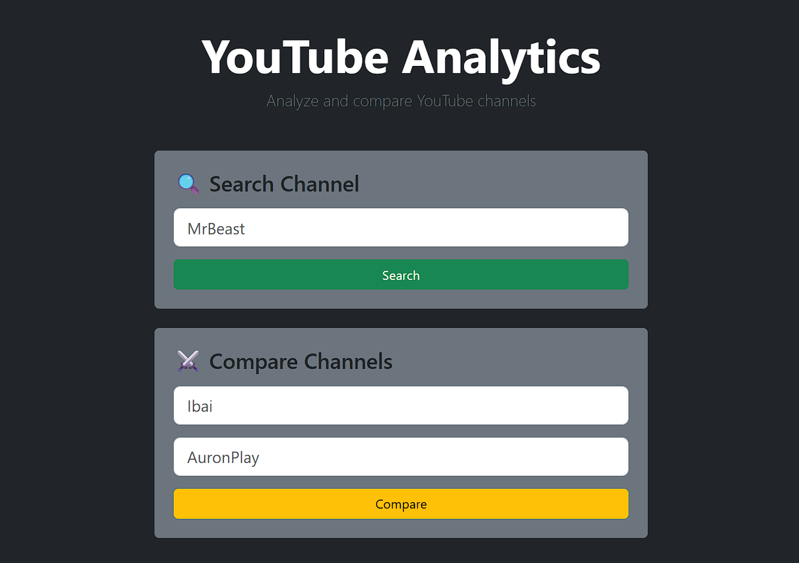

# 📺 YouTube Analytics

Aplicación web desarrollada con FastAPI que permite analizar y comparar canales de YouTube utilizando la API oficial de YouTube Data.

<p align="center">



</p>

---

## 🚀 Funcionalidades

### 🔍 Análisis de canales

Busca cualquier canal de YouTube y obtén de forma inmediata:

- Avatar del canal
- Número de suscriptores
- Visualizaciones totales
- Número de vídeos publicados

---

### 🎬 Vídeos recientes

Visualización de los últimos vídeos publicados por el canal seleccionado.

Incluye:

- Miniaturas de los vídeos
- Título
- Fecha relativa de publicación
- Enlace directo al vídeo en YouTube

---

### ⚔️ Comparador de canales

Compara dos canales de YouTube de forma visual y sencilla.

Métricas disponibles:

- Suscriptores
- Visualizaciones
- Número de vídeos

Diseñado para ofrecer una experiencia clara, responsive y orientada al análisis.

<p align="center">


</p>

---

## 🛠️ Tecnologías utilizadas

### Backend

- FastAPI
- Python
- Requests
- Jinja2
- Python Dotenv

### Frontend

- HTML5
- Bootstrap 5
- Bootstrap Icons

### Servicios externos

- YouTube Data API v3

---

## 🏗️ Estructura del proyecto

```text
youtube-analytics/
│
├── app/
│   ├── routers/
│   │   ├── channels.py
│   │   └── compare.py
│   │
│   ├── services/
│   │   └── youtube_service.py
│   │
│   ├── utils/
│   │   ├── formatters.py
│   │   └── date_formatter.py
│   │
│   ├── templates/
│   │   ├── home.html
│   │   ├── channel.html
│   │   └── compare.html
│   │
│   ├── static/
│   │
│   └── main.py
│
├── requirements.txt
├── .env
└── README.md
```

---

## ⚙️ Instalación

Clona el repositorio:

```bash
git clone https://github.com/MitoNacho/youtube-analytics.git

cd youtube-analytics
```

Crear entorno virtual:

```bash
python -m venv venv
```

Activarlo:

### Windows

```bash
venv\Scripts\activate
```

### Linux / macOS

```bash
source venv/bin/activate
```

Instalar dependencias:

```bash
pip install -r requirements.txt
```

---

## 🔑 Variables de entorno

Crea un archivo `.env` en la raíz del proyecto:

```env
YOUTUBE_API_KEY=tu_api_key
```

La clave puede obtenerse desde Google Cloud Platform habilitando la API:

```text
YouTube Data API v3
```

---

## ▶️ Ejecución local

Iniciar la aplicación:

```bash
uvicorn app.main:app --reload
```

Acceder desde:

```text
http://127.0.0.1:8000
```

---

## 🎯 Objetivos del proyecto

Este proyecto ha sido desarrollado con el objetivo de profundizar en:

- Consumo de APIs externas
- Arquitectura backend con FastAPI
- Organización modular del código
- Gestión de variables de entorno
- Renderizado de plantillas con Jinja2
- Diseño responsive con Bootstrap
- Integración con servicios de terceros
- Buenas prácticas de desarrollo web

---

## 💡 Aspectos destacados

- Arquitectura separada por capas (routers, servicios y utilidades)
- Integración con la API oficial de YouTube
- Interfaz responsive adaptada a dispositivos móviles
- Comparador visual entre canales
- Enlaces directos a los vídeos analizados
- Formateo automático de métricas y fechas

---

## 🌐 Enlaces

### Portfolio

👉 https://mitonacho.github.io/dev/

### GitHub

👉 https://github.com/MitoNacho

---

## 👨‍💻 Autor

**Nacho Naves**

Desarrollador Python enfocado en backend, automatización, APIs y desarrollo web.

